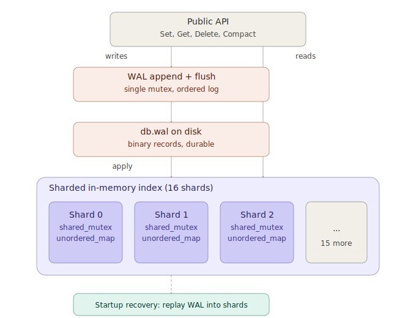

# kvstore

A small embedded key-value store written from scratch in C++20. It's a from-scratch systems exercise — sharded in-memory index for concurrency, a binary write-ahead log for durability, crash recovery on startup, and an online compaction routine that doesn't block readers or writers. No external dependencies, just the standard library.

## How it works



**Sharded index.** The keyspace is split across 16 independent shards (`std::unordered_map` + `std::shared_mutex` each), chosen via `std::hash<std::string> % 16`. Reads take a `shared_lock` so concurrent `Get()` calls on the same shard never block each other; writes take a `unique_lock` scoped to just that shard. There's no global database lock.

**Write-ahead log.** Every `Set` and `Delete` is serialized as a binary record (type + key length + value length + payload), written to `db.wal`, and `flush()`ed before the in-memory shard is updated. If the process dies between the flush and the in-memory update, the WAL still has the record and recovery will replay it.

**Recovery.** On startup, the WAL is read sequentially from the beginning and every record is replayed into the sharded index. If the log ends mid-record (a torn write from a crash), recovery stops cleanly at the last complete record instead of throwing.

**Compaction.** `Compact()` walks each shard under a `shared_lock`, writes only the currently-live key/value pairs to a temp file, then — while holding the WAL's write mutex — closes the old log, renames the temp file into place, and reopens it for appends. Any `Set`/`Delete` in flight either finishes against the old file before the swap or lands in the new file after it; nothing is dropped.

The API is simple:

```cpp
kvstore::KVStore store("data/mydb.db"); // opens (or creates) and recovers

store.Set("hello", "world");            // -> bool
store.Get("hello");                     // -> std::optional<std::string>
store.Delete("hello");                  // -> bool
store.Compact();                        // -> bool
```

## Running it yourself

### Prerequisites

- A C++20 compiler (GCC ≥ 11 or Clang ≥ 14)
- CMake ≥ 3.20
- Linux or macOS

### Build and run

```bash
mkdir build && cd build
cmake -DCMAKE_BUILD_TYPE=Release ..
cmake --build . -j
./kvstore_test
```

`kvstore_test` runs a stress and crash-recovery suite: 4 worker threads doing concurrent writes/reads, a compaction while readers are active, a simulated crash with a torn WAL record, and a restart with full recovery validation. A successful run ends with:

=== ALL TESTS PASSED ===

### Optional: run under sanitizers

```bash
# Data race detection
g++ -std=c++20 -O1 -g -fsanitize=thread -pthread kvstore.cpp main.cpp -o kvstore_tsan
./kvstore_tsan

# Memory errors and undefined behavior
g++ -std=c++20 -O1 -g -fsanitize=address,undefined -pthread kvstore.cpp main.cpp -o kvstore_asan
./kvstore_asan
```
